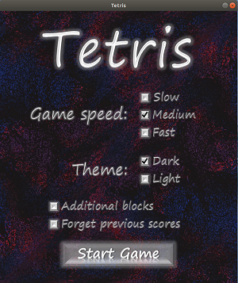
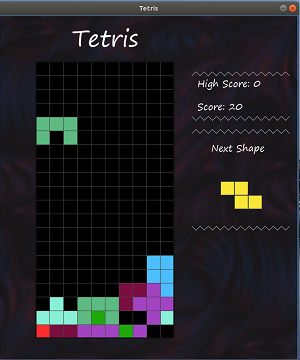

# Tetris 
A project for AGH UST course on Introduction to Computer Science (year 2018/2019)
### GAME DESCRIPTION:
The game contains several game modes. Add new blocks by putting a tick at the "Additional blocks" form.  
If you would like to start a new game, put a tick in front of "Forget previous scores". You may choose from three speeds of game to change the game`s difficulty. As well there are two themes - dark and light - available.




Important: there is no possibility to remove the ticks from "additional blocks" and "forget previous scores" forms. If you want to go back and remove a tick, you must start the game and press escape.

### DEFAULT PARAMETERS:
* dark theme
* medium speed
* no additional blocks
* remember last best score

### GAME INSTRUCTIONS:

* UP arrow - rotate the block
* DOWN arrow - accelerate the falling block
* LEFT arrow - move the block to the left
* RIGHT arrow - move the block to the right
* SPACE - pause the game
* ESCAPE - go back to the main menu

### EXECUTION
```sh
$ pip install pygame
$ python TETRIS_.py
```


`
